# Cortex -- DB 엔티티 관계도 (ERD)

**버전**: 1.0 | **날짜**: 2026-02-27 | **상태**: 확정
**참조**: `docs/system/system-design.md` 4장, `supabase/migrations/001~003`

---

## 1. ERD 다이어그램

```mermaid
erDiagram
    content_items {
        UUID id PK
        TEXT channel "tech | world | culture | canada"
        TEXT source "hackernews | naver_news | melon 등"
        TEXT source_url UK "중복 수집 방지 키"
        TEXT title
        TEXT summary_ai "Claude 생성 1-2줄 요약"
        TEXT full_text
        VECTOR_1536 embedding "pgvector 임베딩"
        TIMESTAMPTZ published_at
        TIMESTAMPTZ collected_at "DEFAULT NOW()"
        TEXT_ARRAY tags "AI 추출 토픽 태그"
        FLOAT score_initial "0.0-1.0 DEFAULT 0.5"
    }

    briefings {
        UUID id PK
        DATE briefing_date UK "날짜당 1건"
        JSONB items "content_id, position, channel, reason"
        TIMESTAMPTZ telegram_sent_at
        BOOLEAN telegram_opened "DEFAULT FALSE"
        TIMESTAMPTZ created_at "DEFAULT NOW()"
    }

    user_interactions {
        UUID id PK
        UUID content_id FK
        UUID briefing_id FK
        TEXT interaction "좋아요 | 싫어요 | 저장 | 메모 | 웹열기 | 링크클릭 | 스킵"
        TEXT memo_text "메모 반응 시 텍스트"
        TEXT source "telegram_bot | web"
        TIMESTAMPTZ created_at "DEFAULT NOW()"
    }

    interest_profile {
        UUID id PK
        TEXT topic UK "토픽명"
        FLOAT score "0.0-1.0 EMA DEFAULT 0.5"
        INT interaction_count "DEFAULT 0"
        TIMESTAMPTZ last_updated "DEFAULT NOW()"
        VECTOR_1536 embedding "토픽 임베딩"
    }

    alert_settings {
        UUID id PK
        TEXT trigger_type UK "toronto_weather | keyword_breaking 등"
        BOOLEAN is_enabled "DEFAULT TRUE"
        TIME quiet_hours_start "DEFAULT 23:00"
        TIME quiet_hours_end "DEFAULT 07:00"
        TIMESTAMPTZ last_triggered_at
        INT daily_count "DEFAULT 0"
        DATE daily_count_reset_at "DEFAULT CURRENT_DATE"
    }

    keyword_contexts {
        UUID id PK
        TEXT source "일기 | 할일 | 메모"
        UUID source_id "My Life OS 원본 레코드 ID"
        TEXT_ARRAY keywords
        VECTOR_1536 embedding
        TIMESTAMPTZ created_at "DEFAULT NOW()"
        TIMESTAMPTZ expires_at "7일 TTL"
    }

    diary_entries {
        UUID id PK
        TEXT text "일기 본문 (읽기 전용)"
    }

    todos {
        UUID id PK
        TEXT title "태스크 제목 (읽기 전용)"
    }

    notes {
        UUID id PK
        TEXT title "메모 제목 (읽기 전용)"
        TEXT body "메모 본문 (읽기 전용)"
    }

    content_items ||--o{ user_interactions : "1:N 반응 기록"
    briefings ||--o{ user_interactions : "1:N 브리핑별 반응"
    diary_entries ||--o{ keyword_contexts : "키워드 추출 (읽기 전용)"
    todos ||--o{ keyword_contexts : "키워드 추출 (읽기 전용)"
    notes ||--o{ keyword_contexts : "키워드 추출 (읽기 전용)"
```

> **My Life OS 테이블** (`diary_entries`, `todos`, `notes`)은 점선 관계로, Cortex에서 **읽기 전용** 참조만 수행한다. 스키마 소유권은 My Life OS 프로젝트에 있으며, Cortex는 `lib/mylifeos.ts`를 통해 격리된 쿼리만 실행한다.

---

## 2. 테이블 개요

### 2.1 Cortex 전용 테이블

| 테이블명 | 설명 | 주요 컬럼 | 관계 |
|----------|------|-----------|------|
| `content_items` | 수집된 모든 콘텐츠 저장 (핵심 테이블) | `id`(PK), `channel`, `source`, `source_url`(UK), `title`, `summary_ai`, `embedding`(VECTOR), `tags`, `score_initial` | `user_interactions`와 1:N |
| `briefings` | 매일 발송된 브리핑 기록 (날짜당 1건) | `id`(PK), `briefing_date`(UK), `items`(JSONB), `telegram_sent_at`, `telegram_opened` | `user_interactions`와 1:N |
| `user_interactions` | 사용자 반응 로그 (학습 엔진 핵심 데이터) | `id`(PK), `content_id`(FK), `briefing_id`(FK), `interaction`, `memo_text`, `source` | `content_items` N:1, `briefings` N:1 |
| `interest_profile` | 학습된 관심사 프로필 (토픽별 EMA 점수) | `id`(PK), `topic`(UK), `score`, `interaction_count`, `embedding`(VECTOR) | 독립 (스코어링 참조용) |
| `alert_settings` | 긴급 알림(Tier 2) 트리거 설정 | `id`(PK), `trigger_type`(UK), `is_enabled`, `quiet_hours_start/end`, `daily_count` | 독립 |
| `keyword_contexts` | My Life OS 일기/메모에서 추출한 키워드 (7일 TTL) | `id`(PK), `source`, `source_id`, `keywords`, `embedding`(VECTOR), `expires_at` | My Life OS 테이블 참조 (논리적) |

### 2.2 My Life OS 연동 테이블 (읽기 전용)

| 테이블명 | 설명 | Cortex에서 읽는 데이터 | 활용 |
|----------|------|----------------------|------|
| `diary_entries` | My Life OS 일기 | 최근 7일 일기 텍스트 | 키워드 추출 -> `keyword_contexts` 저장 -> 브리핑 가중치 |
| `todos` | My Life OS 할일 | 미완료 태스크 제목 | 키워드 추출 -> 관련 아티클 서페이싱 |
| `notes` | My Life OS 메모 | 메모 제목/본문 | 키워드 추출 -> 관련 아티클 서페이싱 |

---

## 3. 관계 설명

### 3.1 FK 참조 관계

| 관계 | 타입 | FK 컬럼 | 참조 대상 | ON DELETE |
|------|------|---------|-----------|-----------|
| `user_interactions` -> `content_items` | N:1 | `content_id` | `content_items(id)` | CASCADE |
| `user_interactions` -> `briefings` | N:1 | `briefing_id` | `briefings(id)` | SET NULL |

- **`content_items` 1:N `user_interactions`**: 하나의 콘텐츠 아이템에 여러 반응(좋아요, 싫어요, 저장, 메모 등)이 기록될 수 있다.
- **`briefings` 1:N `user_interactions`**: 하나의 브리핑에 포함된 아이템들에 대해 여러 반응이 기록된다.
- **`briefings.items`(JSONB)는 `content_items.id`를 논리적으로 참조**하지만, FK 제약은 설정하지 않는다 (JSONB 내부 참조).

### 3.2 논리적 참조 관계 (FK 미설정)

| 관계 | 설명 |
|------|------|
| `briefings.items` -> `content_items.id` | JSONB 내부의 `content_id` 필드가 `content_items.id`를 논리적으로 참조 |
| `keyword_contexts.source_id` -> My Life OS 테이블 | `diary_entries.id`, `todos.id`, `notes.id`를 논리적으로 참조 (DB 간 FK 불가) |
| `interest_profile.topic` <-> `content_items.tags` | 토픽명이 콘텐츠 태그와 매칭되어 스코어링에 활용 |

### 3.3 관계 없는 독립 테이블

| 테이블 | 독립 이유 |
|--------|----------|
| `interest_profile` | 토픽별 집계 데이터로, 다른 테이블과 FK 없이 `topic`명으로 로직 상 연결 |
| `alert_settings` | 시스템 설정 테이블로, 트리거 유형별 1행씩 고정 (초기 5행 INSERT) |

---

## 4. 인덱스 전략 요약

### 4.1 일반 B-tree 인덱스

| 테이블 | 인덱스명 | 대상 컬럼 | 용도 |
|--------|----------|-----------|------|
| `content_items` | `idx_content_items_channel` | `channel` | 채널별 필터링 (TECH/WORLD/CULTURE/TORONTO) |
| `content_items` | `idx_content_items_collected_at` | `collected_at DESC` | 최신순 정렬, 만료 정책 |
| `content_items` | `idx_content_items_source_url` | `source_url` | 중복 수집 방지 조회 (UNIQUE 제약과 별개) |
| `briefings` | `idx_briefings_date` | `briefing_date DESC` | 날짜별 브리핑 조회, 히스토리 |
| `user_interactions` | `idx_interactions_content` | `content_id` | 콘텐츠별 반응 집계 |
| `user_interactions` | `idx_interactions_created` | `created_at DESC` | 최신 반응 조회 |
| `user_interactions` | `idx_interactions_type` | `interaction` | 반응 타입별 필터링/집계 |
| `interest_profile` | `idx_interest_score` | `score DESC` | 상위 관심사 조회 |
| `keyword_contexts` | `idx_keyword_contexts_expires` | `expires_at` | TTL 만료 항목 정리 |

### 4.2 pgvector HNSW 인덱스

모든 벡터 인덱스는 **HNSW (Hierarchical Navigable Small World)** 알고리즘을 사용한다.

| 테이블 | 인덱스명 | 벡터 컬럼 | 파라미터 | 거리 연산 |
|--------|----------|-----------|----------|-----------|
| `content_items` | `idx_content_embedding` | `embedding` (1536차원) | `m=16, ef_construction=64` | `vector_cosine_ops` (코사인 유사도) |
| `interest_profile` | `idx_interest_embedding` | `embedding` (1536차원) | `m=16, ef_construction=64` | `vector_cosine_ops` |
| `keyword_contexts` | `idx_keyword_embedding` | `embedding` (1536차원) | `m=16, ef_construction=64` | `vector_cosine_ops` |

**HNSW 파라미터 설명:**
- `m=16`: 각 노드의 최대 연결 수. 소규모 데이터셋에 적합한 기본값.
- `ef_construction=64`: 인덱스 빌드 시 탐색 범위. 높을수록 정확하지만 빌드 시간 증가.
- 데이터가 **10만 건을 초과**하면 `m=24, ef_construction=128`로 재조정 검토.

**HNSW 선택 근거:**
- 1인 사용자이므로 데이터 규모가 작다 (6개월 기준 `content_items` 약 5,000건 예상).
- HNSW는 IVFFlat 대비 빌드 시간이 길지만 검색 정확도와 속도가 우수하다.
- IVFFlat은 데이터가 충분히 많아야 클러스터링 효과가 나타나므로 소규모에 부적합.

---

## 5. 데이터 만료 정책

| 테이블 | 만료 조건 | TTL/보관 기간 | 구현 방법 | Cron 주기 |
|--------|----------|-------------|----------|----------|
| `content_items` | `collected_at` 기준 90일 경과 | 90일 | `archived_at` 컬럼 추가 후 아카이브 처리 (삭제 아님) | 주 1회 |
| `keyword_contexts` | `expires_at` 도달 | 7일 | `expires_at` 기준 DELETE 실행 | 일 1회 (수집 Cron 내부) |
| `interest_profile` | `score <= 0.2` 이고 `last_updated` 3개월 경과 | 3개월 (score 0.2 이하) | 보관 플래그 설정 또는 별도 archived 테이블 이동 | 월 1회 |
| `user_interactions` | 만료 없음 | 영구 보관 | 학습 데이터로 영구 유지 | - |
| `briefings` | 만료 없음 | 영구 보관 | 히스토리 조회용으로 영구 유지 | - |
| `alert_settings` | 만료 없음 | 영구 유지 | 시스템 설정, 초기 5행 고정 | - |

### 만료 정책 상세

**content_items 아카이브 (90일)**
- 삭제가 아닌 아카이브 처리를 하여 과거 데이터 참조를 유지한다.
- 향후 `archived_at TIMESTAMPTZ` 컬럼을 추가하여 아카이브 시점을 기록한다.
- 아카이브된 아이템의 `embedding`은 NULL로 설정하여 벡터 인덱스 크기를 줄인다.

**keyword_contexts TTL (7일)**
- 수집 시 `expires_at = NOW() + INTERVAL '7 days'`로 설정한다.
- 매일 수집 Cron에서 `DELETE FROM keyword_contexts WHERE expires_at < NOW()`를 실행한다.

**interest_profile 보관 (score 0.2 이하, 3개월)**
- 월 1회 Cron에서 `score <= 0.2 AND last_updated < NOW() - INTERVAL '3 months'` 조건을 확인한다.
- 즉시 삭제하지 않고 보관 처리하여 `/profile` 페이지에서 확인 가능하게 한다 (F-14 AC4).

---

## 6. RLS (Row Level Security) 요약

모든 Cortex 테이블에 RLS가 활성화되어 있다.

| 테이블 | 정책명 | 동작 | 조건 |
|--------|--------|------|------|
| `content_items` | `authenticated_read_content_items` | SELECT | `auth.role() = 'authenticated'` |
| `briefings` | `authenticated_read_briefings` | SELECT | `auth.role() = 'authenticated'` |
| `user_interactions` | `authenticated_read_interactions` | SELECT | `auth.role() = 'authenticated'` |
| `user_interactions` | `authenticated_insert_interactions` | INSERT | `auth.role() = 'authenticated'` |
| `interest_profile` | `authenticated_read_interest_profile` | SELECT | `auth.role() = 'authenticated'` |
| `alert_settings` | `authenticated_read_alert_settings` | SELECT | `auth.role() = 'authenticated'` |
| `alert_settings` | `authenticated_update_alert_settings` | UPDATE | `auth.role() = 'authenticated'` |
| `keyword_contexts` | `authenticated_read_keyword_contexts` | SELECT | `auth.role() = 'authenticated'` |

**RLS 접근 전략:**
- **Cron API Routes**: `SUPABASE_SERVICE_ROLE_KEY` 사용 -> RLS 우회 (서버 전용, Cron Secret으로 보호)
- **웹 대시보드 API Routes**: `SUPABASE_SERVICE_ROLE_KEY` 사용 + Supabase Auth 세션 검증
- **클라이언트 직접 접근**: `NEXT_PUBLIC_SUPABASE_ANON_KEY` 사용 -> RLS 적용

---

## 변경 이력

| 날짜 | 변경 내용 | 이유 |
|------|----------|------|
| 2026-02-27 | 초기 ERD 작성 | system-design.md v1.0 + migration SQL 001~003 기반 |
